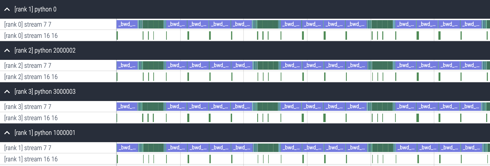

# Ring Attention w/ Flash Attention in PyTorch

This repo contains an implementation of [Ring Attention](https://arxiv.org/abs/2310.01889) (Liu et al. 2023), a method for increasing the context size of attention by partitioning the input sequence across multiple devices and communicating keys & values between devices. It also contains an implementation of [Striped Attention](https://arxiv.org/abs/2311.09431) (Brandon et al. 2023), an extension of Ring Attention that improves performance for causal attention by reducing work imbalance across devices.

These implementations are based on Tri Dao's [Flash Attention](https://github.com/Dao-AILab/flash-attention/tree/f1a73d074002226c42ce65a1df170ecff9f022c0) Triton kernels.

## Performance

Communication and computation are fully overlapped for sufficiently large inputs. For example, the trace below shows several forward/backward passes for Striped Attention with dim 4096, sequence length 32k, batch size 2 distributed across 4 A100 SXM GPUs. This trace was generated by running `python ./test_perf.py`

## Tests

Correctness tests can be run using `pytest test.py`

This code has been tested with triton version `triton==2.0.0.dev20221202.`
